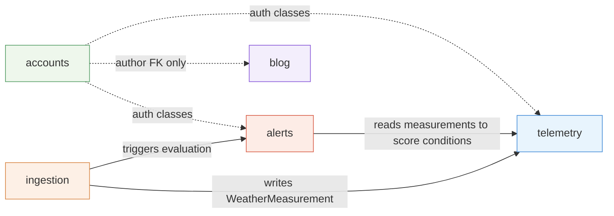
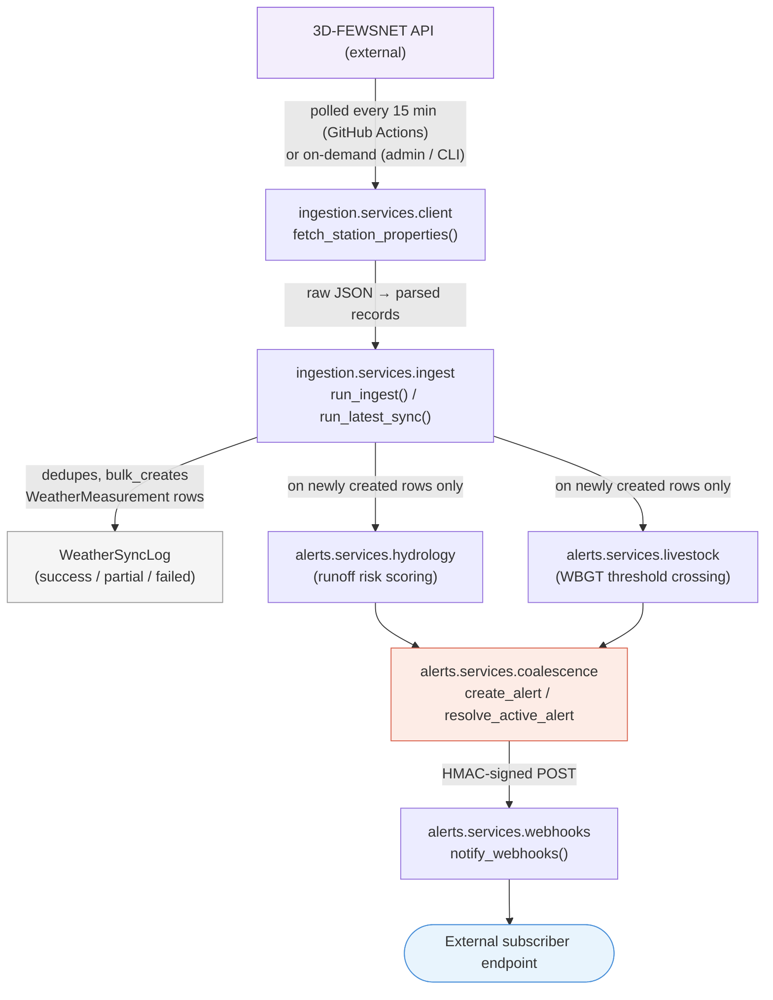
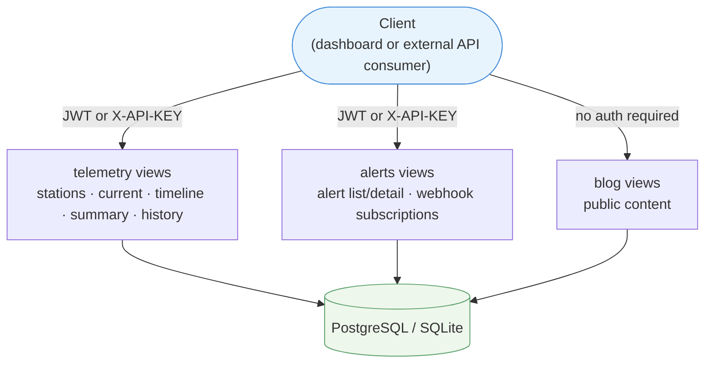

# 2. Architecture

## Django apps and their responsibilities

Conduit is a single Django project (`config`) composed of five apps, each
owning one bounded area of the domain:

| App | Owns | Depends on |
|---|---|---|
| `accounts` | Users, JWT login/signup, API keys, request logging/rate limiting | — (foundational) |
| `telemetry` | `WeatherStation`, `WeatherMeasurement`, read API (current/timeline/summary/history), aggregation logic | `accounts` (auth classes) |
| `ingestion` | Pulling data from the external 3D-FEWSNET API, `WeatherSyncLog`, admin sync endpoints, CLI backfill command | `telemetry` (writes measurements), `alerts` (triggers evaluation after each sync) |
| `alerts` | `Alert`, `WebhookSubscription`, `WebhookDelivery`, hydrology/livestock rule engines, webhook delivery + retries | `telemetry` (reads measurements), `accounts` (auth classes) |
| `blog` | `BlogPost`, public editorial API | `accounts` (author FK only) |

There is a deliberate one-way dependency chain for the telemetry pipeline:

`telemetry` itself does not depend on `ingestion` or `alerts` — it only
exposes data. This keeps the read API (`telemetry`) free of side effects:
nothing happens when you `GET` weather data.

## Request flow: end-to-end data lifecycle

Meanwhile, independently of ingestion, the **read side** serves whatever
is currently in the database:

## Authentication architecture

Two authentication mechanisms coexist, and most "shared" read endpoints
accept either:

- **JWT** (`rest_framework_simplejwt`) — used by the logged-in dashboard
  ("Data Portal"). Configured as the project-wide default authentication
  class in `REST_FRAMEWORK['DEFAULT_AUTHENTICATION_CLASSES']`.
- **API Key** (`X-API-KEY` header) — used by external programmatic
  consumers. Every authenticated request is logged to `APIRequestLog` and
  checked against per-key rate limits (per-minute and daily).

A combined class, `JWTOrAPIKeyAuthentication`, tries JWT first (so a
logged-in dashboard session never counts against a rate limit or gets
logged as "API usage") and falls back to API-key authentication. It's used
by `telemetry` and `alerts` read endpoints. See
[04-authentication-and-authorization.md](./04-authentication-and-authorization.md)
for full detail, including the internal shared-secret endpoints used by
scheduled jobs.

## External integration points

| Integration | Direction | Mechanism |
|---|---|---|
| 3D-FEWSNET API | Inbound data source | HTTP GET with `email` + `api_key` query params (see [10-ingestion-pipeline.md](./10-ingestion-pipeline.md)) |
| GitHub Actions cron | Triggers ingestion | POST to `/api/v1/internal/sync/` with `X-SYNC-TOKEN` shared secret, every 15 minutes |
| Webhook subscribers | Outbound notifications | HMAC-SHA256-signed POST on `alert.created` / `alert.resolved` |

## Why one `Alert` model instead of two

Hydrology and livestock alerts share the same lifecycle (open → active →
resolved), the same list/detail API, the same admin UI, and the same
webhook delivery path. Rather than two near-identical tables, `alerts.Alert`
is a single model with an `alert_type` discriminator and type-specific
nullable fields (rainfall/pressure fields for hydrology, WBGT/threshold
fields for livestock). See [03-data-model.md](./03-data-model.md).

## Deployment shape

Conduit runs as a single Django/WSGI container (see
[14-deployment.md](./14-deployment.md)). There is no separate worker
process — ingestion and alert evaluation happen synchronously inside the
HTTP request that triggers a sync (either the GitHub Actions cron hitting
`/internal/sync/`, or an admin clicking "sync" in the dashboard).
